# [📈 Live Status](https://abelfodil.github.io/upptime-belfodil.ca): <!--live status--> **🟩 All systems operational**

This repository contains the open-source uptime monitor and status page for [Anes Belfodil](https://www.linkedin.com/in/anes-belfodil/), powered by [Upptime](https://github.com/upptime/upptime).

With [Upptime](https://upptime.js.org), you can get your own unlimited and free uptime monitor and status page, powered entirely by a GitHub repository. We use [Issues](https://github.com/abelfodil/upptime-belfodil.ca/issues) as incident reports, [Actions](https://github.com/abelfodil/upptime-belfodil.ca/actions) as uptime monitors, and [Pages](https://abelfodil.github.io/upptime-belfodil.ca) for the status page.

<!--start: status pages-->
<!-- This summary is generated by Upptime (https://github.com/upptime/upptime) -->
<!-- Do not edit this manually, your changes will be overwritten -->
<!-- prettier-ignore -->
| URL | Status | History | Response Time | Uptime |
| --- | ------ | ------- | ------------- | ------ |
|  [argo-cd-argocd-server](https://argo.belfodil.ca) | 🟩 Up | [argo-cd-argocd-server.yml](https://github.com/abelfodil/upptime-belfodil.ca/commits/HEAD/history/argo-cd-argocd-server.yml) | 

 361ms
     
 | 

<a href="https://abelfodil.github.io/upptime-belfodil.ca/history/argo-cd-argocd-server">100.00%</a>
    

|  [authentik](https://auth.belfodil.ca) | 🟩 Up | [authentik.yml](https://github.com/abelfodil/upptime-belfodil.ca/commits/HEAD/history/authentik.yml) | 

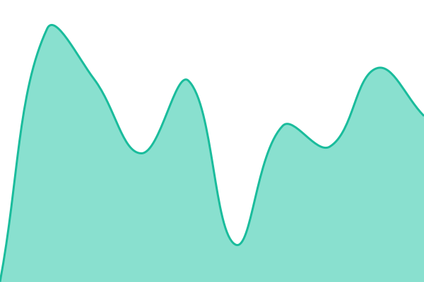 766ms
     
 | 

<a href="https://abelfodil.github.io/upptime-belfodil.ca/history/authentik">99.54%</a>
    

|  [archivebox](https://archive.belfodil.ca) | 🟩 Up | [archivebox.yml](https://github.com/abelfodil/upptime-belfodil.ca/commits/HEAD/history/archivebox.yml) | 

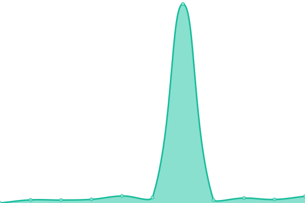 508ms
     
 | 

<a href="https://abelfodil.github.io/upptime-belfodil.ca/history/archivebox">99.54%</a>
    

|  [bazarr](https://bazarr.belfodil.ca) | 🟩 Up | [bazarr.yml](https://github.com/abelfodil/upptime-belfodil.ca/commits/HEAD/history/bazarr.yml) | 

 343ms
     
 | 

<a href="https://abelfodil.github.io/upptime-belfodil.ca/history/bazarr">99.38%</a>
    

|  [epicgames-freegames](https://epicgames-freegames.belfodil.ca) | 🟩 Up | [epicgames-freegames.yml](https://github.com/abelfodil/upptime-belfodil.ca/commits/HEAD/history/epicgames-freegames.yml) | 

 339ms
     
 | 

<a href="https://abelfodil.github.io/upptime-belfodil.ca/history/epicgames-freegames">96.24%</a>
    

|  [filebrowser](https://filebrowser.belfodil.ca) | 🟩 Up | [filebrowser.yml](https://github.com/abelfodil/upptime-belfodil.ca/commits/HEAD/history/filebrowser.yml) | 

 341ms
     
 | 

<a href="https://abelfodil.github.io/upptime-belfodil.ca/history/filebrowser">99.85%</a>
    

|  [gotify](https://gotify.belfodil.ca) | 🟩 Up | [gotify.yml](https://github.com/abelfodil/upptime-belfodil.ca/commits/HEAD/history/gotify.yml) | 

 352ms
     
 | 

<a href="https://abelfodil.github.io/upptime-belfodil.ca/history/gotify">99.54%</a>
    

|  [grafana](https://grafana.belfodil.ca) | 🟩 Up | [grafana.yml](https://github.com/abelfodil/upptime-belfodil.ca/commits/HEAD/history/grafana.yml) | 

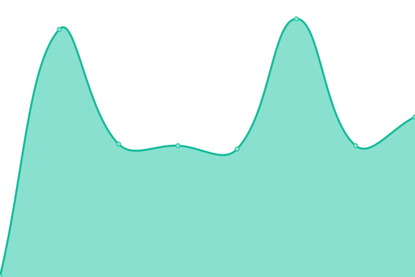 338ms
     
 | 

<a href="https://abelfodil.github.io/upptime-belfodil.ca/history/grafana">100.00%</a>
    

|  [headlamp](https://headlamp.belfodil.ca) | 🟩 Up | [headlamp.yml](https://github.com/abelfodil/upptime-belfodil.ca/commits/HEAD/history/headlamp.yml) | 

 333ms
     
 | 

<a href="https://abelfodil.github.io/upptime-belfodil.ca/history/headlamp">100.00%</a>
    

|  [home-assistant](https://ha.belfodil.ca) | 🟩 Up | [home-assistant.yml](https://github.com/abelfodil/upptime-belfodil.ca/commits/HEAD/history/home-assistant.yml) | 

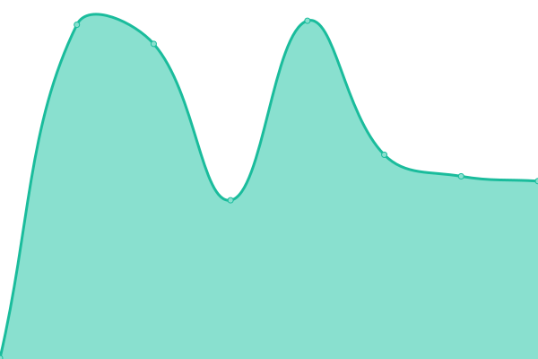 338ms
     
 | 

<a href="https://abelfodil.github.io/upptime-belfodil.ca/history/home-assistant">100.00%</a>
    

|  [homer-operator](https://dash.belfodil.ca) | 🟩 Up | [homer-operator.yml](https://github.com/abelfodil/upptime-belfodil.ca/commits/HEAD/history/homer-operator.yml) | 

 333ms
     
 | 

<a href="https://abelfodil.github.io/upptime-belfodil.ca/history/homer-operator">100.00%</a>
    

|  [immich](https://immich.belfodil.ca) | 🟩 Up | [immich.yml](https://github.com/abelfodil/upptime-belfodil.ca/commits/HEAD/history/immich.yml) | 

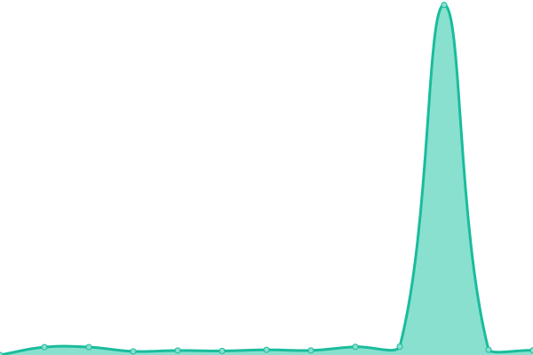 315ms
     
 | 

<a href="https://abelfodil.github.io/upptime-belfodil.ca/history/immich">99.85%</a>
    

|  [inventree](https://inventree.belfodil.ca) | 🟩 Up | [inventree.yml](https://github.com/abelfodil/upptime-belfodil.ca/commits/HEAD/history/inventree.yml) | 

 651ms
     
 | 

<a href="https://abelfodil.github.io/upptime-belfodil.ca/history/inventree">100.00%</a>
    

|  [jellyfin](https://jellyfin.belfodil.ca) | 🟩 Up | [jellyfin.yml](https://github.com/abelfodil/upptime-belfodil.ca/commits/HEAD/history/jellyfin.yml) | 

 402ms
     
 | 

<a href="https://abelfodil.github.io/upptime-belfodil.ca/history/jellyfin">100.00%</a>
    

|  [jellyseerr](https://jellyseerr.belfodil.ca) | 🟩 Up | [jellyseerr.yml](https://github.com/abelfodil/upptime-belfodil.ca/commits/HEAD/history/jellyseerr.yml) | 

 915ms
     
 | 

<a href="https://abelfodil.github.io/upptime-belfodil.ca/history/jellyseerr">99.16%</a>
    

|  [lazylibrarian](https://lib.belfodil.ca) | 🟩 Up | [lazylibrarian.yml](https://github.com/abelfodil/upptime-belfodil.ca/commits/HEAD/history/lazylibrarian.yml) | 

 462ms
     
 | 

<a href="https://abelfodil.github.io/upptime-belfodil.ca/history/lazylibrarian">100.00%</a>
    

|  [miniflux](https://miniflux.belfodil.ca) | 🟩 Up | [miniflux.yml](https://github.com/abelfodil/upptime-belfodil.ca/commits/HEAD/history/miniflux.yml) | 

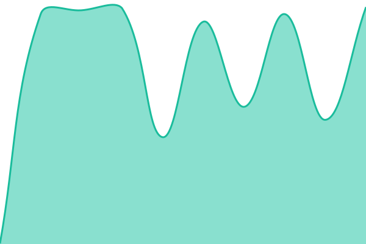 348ms
     
 | 

<a href="https://abelfodil.github.io/upptime-belfodil.ca/history/miniflux">100.00%</a>
    

|  [minio](https://minio.belfodil.ca) | 🟩 Up | [minio.yml](https://github.com/abelfodil/upptime-belfodil.ca/commits/HEAD/history/minio.yml) | 

 355ms
     
 | 

<a href="https://abelfodil.github.io/upptime-belfodil.ca/history/minio">99.16%</a>
    

|  [netbox](https://netbox.belfodil.ca) | 🟩 Up | [netbox.yml](https://github.com/abelfodil/upptime-belfodil.ca/commits/HEAD/history/netbox.yml) | 

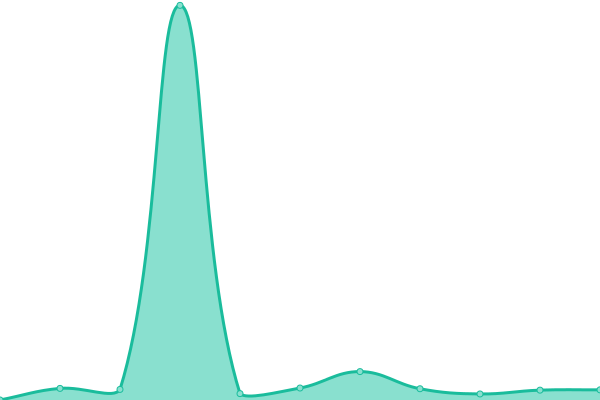 492ms
     
 | 

<a href="https://abelfodil.github.io/upptime-belfodil.ca/history/netbox">100.00%</a>
    

|  [nextcloud](https://nextcloud.belfodil.ca) | 🟩 Up | [nextcloud.yml](https://github.com/abelfodil/upptime-belfodil.ca/commits/HEAD/history/nextcloud.yml) | 

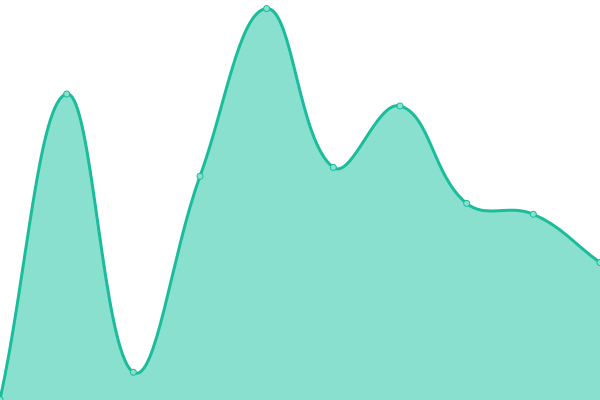 605ms
     
 | 

<a href="https://abelfodil.github.io/upptime-belfodil.ca/history/nextcloud">99.54%</a>
    

|  [nodemation](https://n8n.belfodil.ca) | 🟩 Up | [nodemation.yml](https://github.com/abelfodil/upptime-belfodil.ca/commits/HEAD/history/nodemation.yml) | 

 932ms
     
 | 

<a href="https://abelfodil.github.io/upptime-belfodil.ca/history/nodemation">99.54%</a>
    

|  [obico-server](https://obico.belfodil.ca) | 🟩 Up | [obico-server.yml](https://github.com/abelfodil/upptime-belfodil.ca/commits/HEAD/history/obico-server.yml) | 

 647ms
     
 | 

<a href="https://abelfodil.github.io/upptime-belfodil.ca/history/obico-server">100.00%</a>
    

|  [octoprint](https://octoprint.belfodil.ca) | 🟩 Up | [octoprint.yml](https://github.com/abelfodil/upptime-belfodil.ca/commits/HEAD/history/octoprint.yml) | 

 512ms
     
 | 

<a href="https://abelfodil.github.io/upptime-belfodil.ca/history/octoprint">100.00%</a>
    

|  [octoprint-webcam](https://octoprint-webcam.belfodil.ca) | 🟩 Up | [octoprint-webcam.yml](https://github.com/abelfodil/upptime-belfodil.ca/commits/HEAD/history/octoprint-webcam.yml) | 

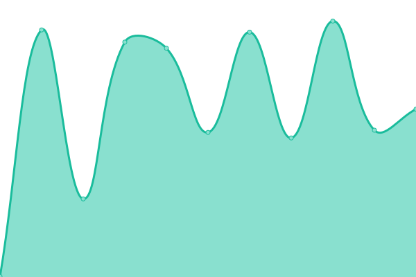 323ms
     
 | 

<a href="https://abelfodil.github.io/upptime-belfodil.ca/history/octoprint-webcam">100.00%</a>
    

|  [pgadmin4](https://pgadmin4.belfodil.ca) | 🟩 Up | [pgadmin4.yml](https://github.com/abelfodil/upptime-belfodil.ca/commits/HEAD/history/pgadmin4.yml) | 

 329ms
     
 | 

<a href="https://abelfodil.github.io/upptime-belfodil.ca/history/pgadmin4">100.00%</a>
    

|  [prowlarr](https://prowlarr.belfodil.ca) | 🟩 Up | [prowlarr.yml](https://github.com/abelfodil/upptime-belfodil.ca/commits/HEAD/history/prowlarr.yml) | 

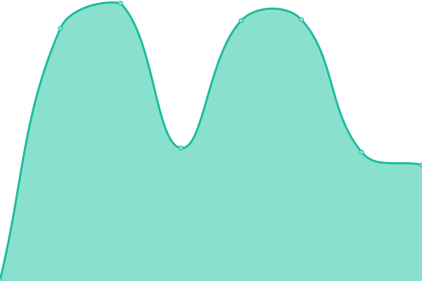 419ms
     
 | 

<a href="https://abelfodil.github.io/upptime-belfodil.ca/history/prowlarr">99.54%</a>
    

|  [radarr](https://radarr.belfodil.ca) | 🟩 Up | [radarr.yml](https://github.com/abelfodil/upptime-belfodil.ca/commits/HEAD/history/radarr.yml) | 

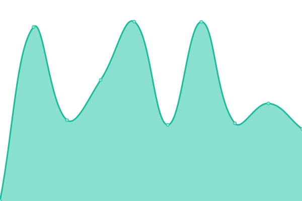 406ms
     
 | 

<a href="https://abelfodil.github.io/upptime-belfodil.ca/history/radarr">100.00%</a>
    

|  [redis-insight](https://redis.belfodil.ca) | 🟩 Up | [redis-insight.yml](https://github.com/abelfodil/upptime-belfodil.ca/commits/HEAD/history/redis-insight.yml) | 

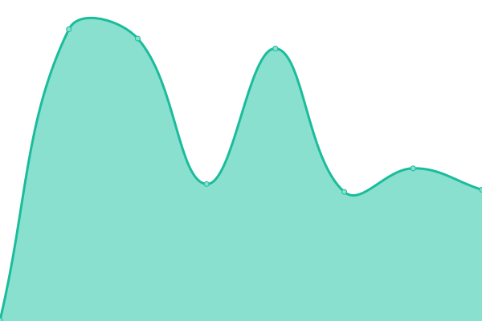 323ms
     
 | 

<a href="https://abelfodil.github.io/upptime-belfodil.ca/history/redis-insight">100.00%</a>
    

|  [sonarr](https://sonarr.belfodil.ca) | 🟩 Up | [sonarr.yml](https://github.com/abelfodil/upptime-belfodil.ca/commits/HEAD/history/sonarr.yml) | 

 462ms
     
 | 

<a href="https://abelfodil.github.io/upptime-belfodil.ca/history/sonarr">100.00%</a>
    

|  [tdarr](https://tdarr.belfodil.ca) | 🟩 Up | [tdarr.yml](https://github.com/abelfodil/upptime-belfodil.ca/commits/HEAD/history/tdarr.yml) | 

 350ms
     
 | 

<a href="https://abelfodil.github.io/upptime-belfodil.ca/history/tdarr">99.22%</a>
    

|  [transmission](https://transmission.belfodil.ca) | 🟩 Up | [transmission.yml](https://github.com/abelfodil/upptime-belfodil.ca/commits/HEAD/history/transmission.yml) | 

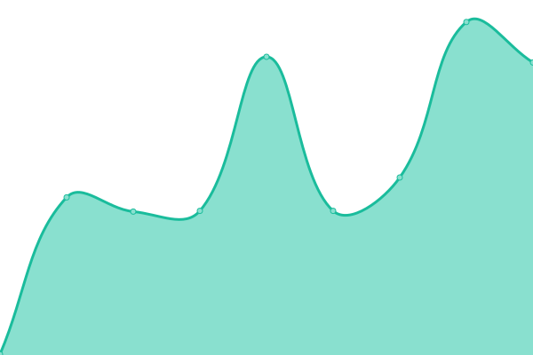 328ms
     
 | 

<a href="https://abelfodil.github.io/upptime-belfodil.ca/history/transmission">100.00%</a>
    

|  [traefik-dashboard](https://traefik.belfodil.ca) | 🟩 Up | [traefik-dashboard.yml](https://github.com/abelfodil/upptime-belfodil.ca/commits/HEAD/history/traefik-dashboard.yml) | 

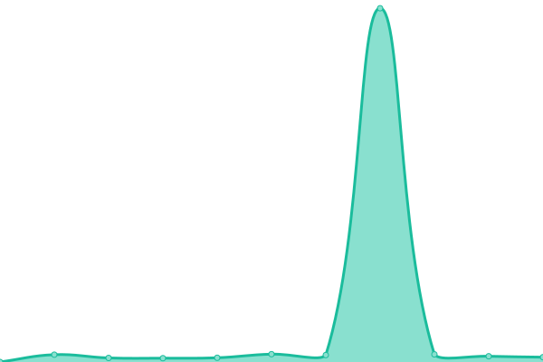 328ms
     
 | 

<a href="https://abelfodil.github.io/upptime-belfodil.ca/history/traefik-dashboard">100.00%</a>
    

|  [Minecraft Bedrock](https://api.mcsrvstat.us/bedrock/simple/home.belfodil.ca:30778) | 🟩 Up | [minecraft-bedrock.yml](https://github.com/abelfodil/upptime-belfodil.ca/commits/HEAD/history/minecraft-bedrock.yml) | 

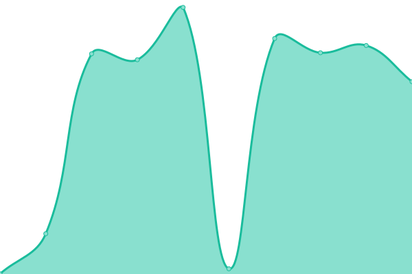 1370ms
     
 | 

<a href="https://abelfodil.github.io/upptime-belfodil.ca/history/minecraft-bedrock">99.34%</a>
    

|  [wakapi](https://wakapi.belfodil.ca) | 🟩 Up | [wakapi.yml](https://github.com/abelfodil/upptime-belfodil.ca/commits/HEAD/history/wakapi.yml) | 

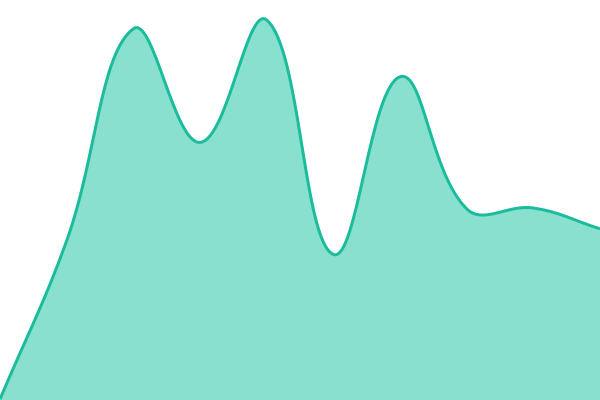 371ms
     
 | 

<a href="https://abelfodil.github.io/upptime-belfodil.ca/history/wakapi">100.00%</a>
    

<!--end: status pages-->

[**Visit our status website →**](https://abelfodil.github.io/upptime-belfodil.ca)

## 📄 License

- Powered by: [Upptime](https://github.com/upptime/upptime)
- Code: [MIT](./LICENSE) © [Anand Chowdhary](https://anandchowdhary.com), supported by [Pabio](https://pabio.com)
- Data in the `./history` directory: [Open Database License](https://opendatacommons.org/licenses/odbl/1-0/)
