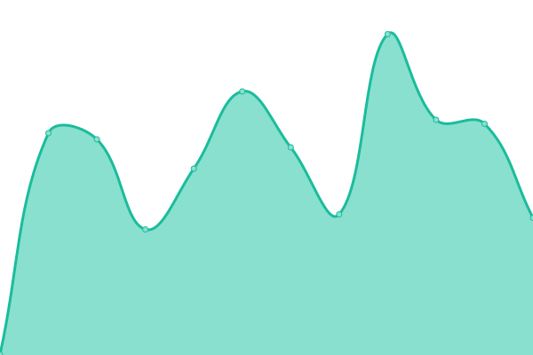

# [📈 Live Status](https://abelfodil.github.io/upptime-belfodil.ca): <!--live status--> **🟧 Partial outage**

This repository contains the open-source uptime monitor and status page for [Anes Belfodil](https://www.linkedin.com/in/anes-belfodil/), powered by [Upptime](https://github.com/upptime/upptime).

With [Upptime](https://upptime.js.org), you can get your own unlimited and free uptime monitor and status page, powered entirely by a GitHub repository. We use [Issues](https://github.com/abelfodil/upptime-belfodil.ca/issues) as incident reports, [Actions](https://github.com/abelfodil/upptime-belfodil.ca/actions) as uptime monitors, and [Pages](https://abelfodil.github.io/upptime-belfodil.ca) for the status page.

<!--start: status pages-->
<!-- This summary is generated by Upptime (https://github.com/upptime/upptime) -->
<!-- Do not edit this manually, your changes will be overwritten -->
<!-- prettier-ignore -->
| URL | Status | History | Response Time | Uptime |
| --- | ------ | ------- | ------------- | ------ |
|  [argo-cd-argocd-server](https://argo.belfodil.ca) | 🟩 Up | [argo-cd-argocd-server.yml](https://github.com/abelfodil/upptime-belfodil.ca/commits/HEAD/history/argo-cd-argocd-server.yml) | 

 313ms
     
 | 

<a href="https://abelfodil.github.io/upptime-belfodil.ca/history/argo-cd-argocd-server">92.57%</a>
    

|  [bazarr](https://bazarr.belfodil.ca) | 🟩 Up | [bazarr.yml](https://github.com/abelfodil/upptime-belfodil.ca/commits/HEAD/history/bazarr.yml) | 

 322ms
     
 | 

<a href="https://abelfodil.github.io/upptime-belfodil.ca/history/bazarr">93.13%</a>
    

|  [duplicati](https://duplicati.belfodil.ca) | 🟩 Up | [duplicati.yml](https://github.com/abelfodil/upptime-belfodil.ca/commits/HEAD/history/duplicati.yml) | 

 323ms
     
 | 

<a href="https://abelfodil.github.io/upptime-belfodil.ca/history/duplicati">91.21%</a>
    

|  [epicgames-freegames](https://epicgames-freegames.belfodil.ca) | 🟩 Up | [epicgames-freegames.yml](https://github.com/abelfodil/upptime-belfodil.ca/commits/HEAD/history/epicgames-freegames.yml) | 

 301ms
     
 | 

<a href="https://abelfodil.github.io/upptime-belfodil.ca/history/epicgames-freegames">92.72%</a>
    

|  [filebrowser](https://filebrowser.belfodil.ca) | 🟩 Up | [filebrowser.yml](https://github.com/abelfodil/upptime-belfodil.ca/commits/HEAD/history/filebrowser.yml) | 

 283ms
     
 | 

<a href="https://abelfodil.github.io/upptime-belfodil.ca/history/filebrowser">92.98%</a>
    

|  [gotify](https://gotify.belfodil.ca) | 🟩 Up | [gotify.yml](https://github.com/abelfodil/upptime-belfodil.ca/commits/HEAD/history/gotify.yml) | 

 301ms
     
 | 

<a href="https://abelfodil.github.io/upptime-belfodil.ca/history/gotify">92.41%</a>
    

|  [homer-operator](https://dash.belfodil.ca) | 🟩 Up | [homer-operator.yml](https://github.com/abelfodil/upptime-belfodil.ca/commits/HEAD/history/homer-operator.yml) | 

 303ms
     
 | 

<a href="https://abelfodil.github.io/upptime-belfodil.ca/history/homer-operator">93.19%</a>
    

|  [immich](https://immich.belfodil.ca) | 🟩 Up | [immich.yml](https://github.com/abelfodil/upptime-belfodil.ca/commits/HEAD/history/immich.yml) | 

 305ms
     
 | 

<a href="https://abelfodil.github.io/upptime-belfodil.ca/history/immich">90.10%</a>
    

|  [inventree](https://inventree.belfodil.ca) | 🟩 Up | [inventree.yml](https://github.com/abelfodil/upptime-belfodil.ca/commits/HEAD/history/inventree.yml) | 

 468ms
     
 | 

<a href="https://abelfodil.github.io/upptime-belfodil.ca/history/inventree">54.44%</a>
    

|  [jaeger](https://jaeger.belfodil.ca) | 🟩 Up | [jaeger.yml](https://github.com/abelfodil/upptime-belfodil.ca/commits/HEAD/history/jaeger.yml) | 

 285ms
     
 | 

<a href="https://abelfodil.github.io/upptime-belfodil.ca/history/jaeger">91.18%</a>
    

|  [jellyfin](https://jellyfin.belfodil.ca) | 🟩 Up | [jellyfin.yml](https://github.com/abelfodil/upptime-belfodil.ca/commits/HEAD/history/jellyfin.yml) | 

 363ms
     
 | 

<a href="https://abelfodil.github.io/upptime-belfodil.ca/history/jellyfin">93.90%</a>
    

|  [jellyseerr](https://jellyseerr.belfodil.ca) | 🟩 Up | [jellyseerr.yml](https://github.com/abelfodil/upptime-belfodil.ca/commits/HEAD/history/jellyseerr.yml) | 

 622ms
     
 | 

<a href="https://abelfodil.github.io/upptime-belfodil.ca/history/jellyseerr">92.74%</a>
    

|  [kubeclarity-kubeclarity](https://kubeclarity.belfodil.ca) | 🟩 Up | [kubeclarity-kubeclarity.yml](https://github.com/abelfodil/upptime-belfodil.ca/commits/HEAD/history/kubeclarity-kubeclarity.yml) | 

 304ms
     
 | 

<a href="https://abelfodil.github.io/upptime-belfodil.ca/history/kubeclarity-kubeclarity">93.79%</a>
    

|  [kubernetes-dashboard](https://kubernetes.belfodil.ca) | 🟩 Up | [kubernetes-dashboard.yml](https://github.com/abelfodil/upptime-belfodil.ca/commits/HEAD/history/kubernetes-dashboard.yml) | 

 276ms
     
 | 

<a href="https://abelfodil.github.io/upptime-belfodil.ca/history/kubernetes-dashboard">94.23%</a>
    

|  [miniflux](https://miniflux.belfodil.ca) | 🟩 Up | [miniflux.yml](https://github.com/abelfodil/upptime-belfodil.ca/commits/HEAD/history/miniflux.yml) | 

 319ms
     
 | 

<a href="https://abelfodil.github.io/upptime-belfodil.ca/history/miniflux">91.00%</a>
    

|  [netdata](https://netdata.belfodil.ca) | 🟩 Up | [netdata.yml](https://github.com/abelfodil/upptime-belfodil.ca/commits/HEAD/history/netdata.yml) | 

 273ms
     
 | 

<a href="https://abelfodil.github.io/upptime-belfodil.ca/history/netdata">92.50%</a>
    

|  [nextcloud](https://nextcloud.belfodil.ca) | 🟩 Up | [nextcloud.yml](https://github.com/abelfodil/upptime-belfodil.ca/commits/HEAD/history/nextcloud.yml) | 

 521ms
     
 | 

<a href="https://abelfodil.github.io/upptime-belfodil.ca/history/nextcloud">88.82%</a>
    

|  [nodemation](https://n8n.belfodil.ca) | 🟥 Down | [nodemation.yml](https://github.com/abelfodil/upptime-belfodil.ca/commits/HEAD/history/nodemation.yml) | 

 299ms
     
 | 

<a href="https://abelfodil.github.io/upptime-belfodil.ca/history/nodemation">90.27%</a>
    

|  [obico-server](https://obico.belfodil.ca) | 🟩 Up | [obico-server.yml](https://github.com/abelfodil/upptime-belfodil.ca/commits/HEAD/history/obico-server.yml) | 

 457ms
     
 | 

<a href="https://abelfodil.github.io/upptime-belfodil.ca/history/obico-server">92.05%</a>
    

|  [octoprint](https://octoprint.belfodil.ca) | 🟥 Down | [octoprint.yml](https://github.com/abelfodil/upptime-belfodil.ca/commits/HEAD/history/octoprint.yml) | 

 410ms
     
 | 

<a href="https://abelfodil.github.io/upptime-belfodil.ca/history/octoprint">35.14%</a>
    

|  [octoprint-webcam](https://octoprint-webcam.belfodil.ca) | 🟩 Up | [octoprint-webcam.yml](https://github.com/abelfodil/upptime-belfodil.ca/commits/HEAD/history/octoprint-webcam.yml) | 

 290ms
     
 | 

<a href="https://abelfodil.github.io/upptime-belfodil.ca/history/octoprint-webcam">91.23%</a>
    

|  [pgadmin4](https://pgadmin4.belfodil.ca) | 🟥 Down | [pgadmin4.yml](https://github.com/abelfodil/upptime-belfodil.ca/commits/HEAD/history/pgadmin4.yml) | 

 287ms
     
 | 

<a href="https://abelfodil.github.io/upptime-belfodil.ca/history/pgadmin4">93.74%</a>
    

|  [prowlarr](https://prowlarr.belfodil.ca) | 🟩 Up | [prowlarr.yml](https://github.com/abelfodil/upptime-belfodil.ca/commits/HEAD/history/prowlarr.yml) | 

 322ms
     
 | 

<a href="https://abelfodil.github.io/upptime-belfodil.ca/history/prowlarr">93.42%</a>
    

|  [radarr](https://radarr.belfodil.ca) | 🟩 Up | [radarr.yml](https://github.com/abelfodil/upptime-belfodil.ca/commits/HEAD/history/radarr.yml) | 

 342ms
     
 | 

<a href="https://abelfodil.github.io/upptime-belfodil.ca/history/radarr">89.70%</a>
    

|  [readarr](https://readarr.belfodil.ca) | 🟩 Up | [readarr.yml](https://github.com/abelfodil/upptime-belfodil.ca/commits/HEAD/history/readarr.yml) | 

 339ms
     
 | 

<a href="https://abelfodil.github.io/upptime-belfodil.ca/history/readarr">92.78%</a>
    

|  [redis-insight](https://redis.belfodil.ca) | 🟩 Up | [redis-insight.yml](https://github.com/abelfodil/upptime-belfodil.ca/commits/HEAD/history/redis-insight.yml) | 

 281ms
     
 | 

<a href="https://abelfodil.github.io/upptime-belfodil.ca/history/redis-insight">94.13%</a>
    

|  [sonarr](https://sonarr.belfodil.ca) | 🟩 Up | [sonarr.yml](https://github.com/abelfodil/upptime-belfodil.ca/commits/HEAD/history/sonarr.yml) | 

 345ms
     
 | 

<a href="https://abelfodil.github.io/upptime-belfodil.ca/history/sonarr">93.03%</a>
    

|  [speedtest-tracker](https://speedtest.belfodil.ca) | 🟥 Down | [speedtest-tracker.yml](https://github.com/abelfodil/upptime-belfodil.ca/commits/HEAD/history/speedtest-tracker.yml) | 

 696ms
     
 | 

<a href="https://abelfodil.github.io/upptime-belfodil.ca/history/speedtest-tracker">93.49%</a>
    

|  [tandoor](https://tandoor.belfodil.ca) | 🟩 Up | [tandoor.yml](https://github.com/abelfodil/upptime-belfodil.ca/commits/HEAD/history/tandoor.yml) | 

 470ms
     
 | 

<a href="https://abelfodil.github.io/upptime-belfodil.ca/history/tandoor">94.47%</a>
    

|  [tdarr](https://tdarr.belfodil.ca) | 🟩 Up | [tdarr.yml](https://github.com/abelfodil/upptime-belfodil.ca/commits/HEAD/history/tdarr.yml) | 

 293ms
     
 | 

<a href="https://abelfodil.github.io/upptime-belfodil.ca/history/tdarr">93.29%</a>
    

|  [transmission](https://transmission.belfodil.ca) | 🟩 Up | [transmission.yml](https://github.com/abelfodil/upptime-belfodil.ca/commits/HEAD/history/transmission.yml) | 

 326ms
     
 | 

<a href="https://abelfodil.github.io/upptime-belfodil.ca/history/transmission">91.96%</a>
    

|  [traefik-dashboard](https://traefik.belfodil.ca) | 🟩 Up | [traefik-dashboard.yml](https://github.com/abelfodil/upptime-belfodil.ca/commits/HEAD/history/traefik-dashboard.yml) | 

 285ms
     
 | 

<a href="https://abelfodil.github.io/upptime-belfodil.ca/history/traefik-dashboard">95.02%</a>
    

|  [Minecraft Bedrock](https://api.mcsrvstat.us/bedrock/simple/home.belfodil.ca:30778) | 🟩 Up | [minecraft-bedrock.yml](https://github.com/abelfodil/upptime-belfodil.ca/commits/HEAD/history/minecraft-bedrock.yml) | 

 101ms
     
 | 

<a href="https://abelfodil.github.io/upptime-belfodil.ca/history/minecraft-bedrock">100.00%</a>
    

<!--end: status pages-->

[**Visit our status website →**](https://abelfodil.github.io/upptime-belfodil.ca)

## 📄 License

- Powered by: [Upptime](https://github.com/upptime/upptime)
- Code: [MIT](./LICENSE) © [Anand Chowdhary](https://anandchowdhary.com), supported by [Pabio](https://pabio.com)
- Data in the `./history` directory: [Open Database License](https://opendatacommons.org/licenses/odbl/1-0/)
